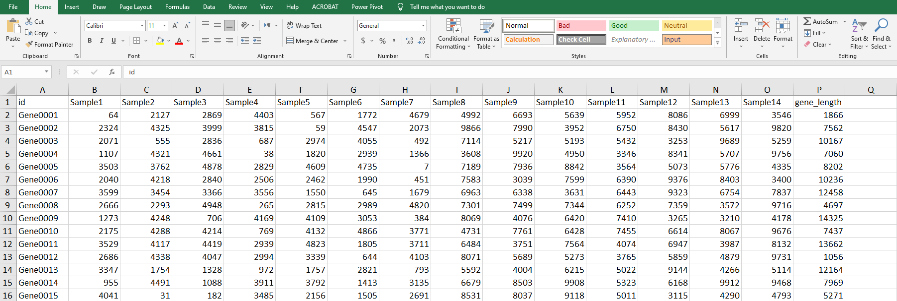

Raw data Normalization in Shiny
===========
[Normalization App!](https://bmustafa12.shinyapps.io/Normalization/)   
[Information](index.html)

This interactive Shiny application lets the user upload their dataset and get normalized data in excel workbook. It also lets you take a quick look on the underlying and processed dataset itself.

## Overview

### Data Input
You can upload your own in any delimited flat file format, considering the data should include **gene_length** column. 
The first column contains the geneID's and remaining columns consist the raw read counts of your samples.

### Variable Selection
You can select the delimiter in the given space and the data will be adjusted into a data table.

### Credits
Thanks goes to [mb-bioinfo-analyst](https://github.com/mb-bioinfo-analyst).
You may visit the following for more;

[Portfolio](https://mb-bioinfo-analyst.github.io/Portfolio/)

[Publications](https://sites.google.com/view/bilalmustafa/publications?authuser=0)

[RNA-Seq Analysis: A Beginner’s Guide to Understanding Gene Expression Using R](https://rnaseqanalysis.netlify.app/)

[Accessing data from SQL using R](https://mb-bioinfo-analyst.github.io/Tutorials/R2SQL.nb.html)

## LICENSE
MIT
